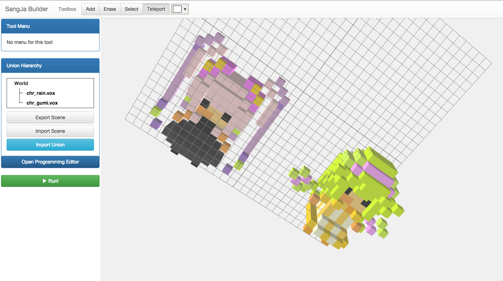

# vox2union

[MagicaVoxel][1]에서 사용되는 내부 포맷인 `*.vox` 파일을 읽어서
상자 프로젝트에서 사용되는 `*.union` 포맷으로 변환시켜주는 도구입니다.

vox 포맷 스펙은 [이 게시글][2]을 참조하였습니다.



[1]: https://voxel.codeplex.com/
[2]: https://voxel.codeplex.com/discussions/461060


## 커맨드라인에서 사용하기

```sh
sudo npm install -g .
vox2union example.vox > example.union
```
